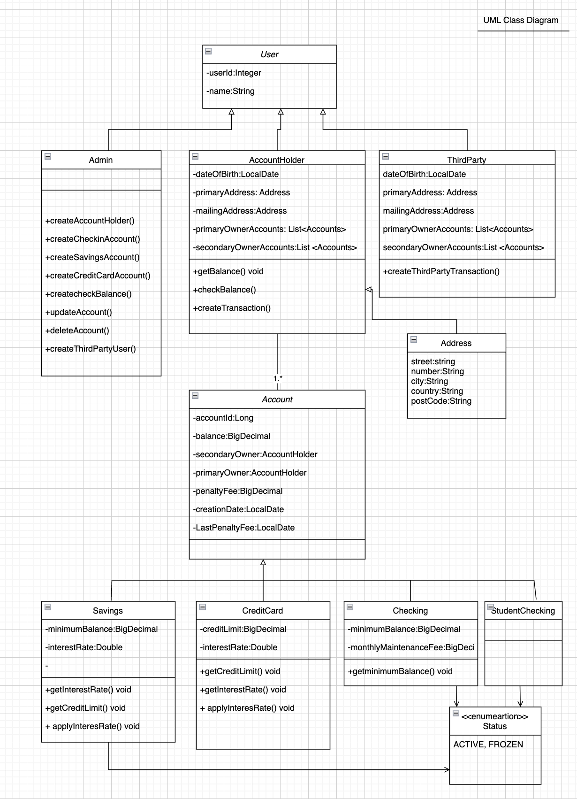

# Banking System
## Final Project for IronHack BackEnd Bootcamp

The goal of this project is to develop a banking system API that enables the operation of a basic bank system by creating and managing users, accounts, transactions, and their interactions.

This system can:
- Create different types of accounts, each with its own set of features, such as a checking account, a student checking account, a savings account, and a credit card.
- Create stack holders in the following roles: admin, account holder, and third party.
- carry out transactions between accounts and on behalf of a third party.
- obtain account balance
- update account information

## Tech Stack
- Java (v19)
- JUnit (v4.13.2)
- Maven
- PostMan
- SpringBoot (v3.0.2) dependencies:
    - Spring Boot Dev Tools
    - Spring Web
    - Spring Data JPA
    - MySQL Driver
    - Spring Security
## Features
- Runs on a local server
- Data stored in MySQL


## Run Locally

Clone the project


```bash
  https://github.com/estelcm/BankingSystem.git
```
## Project Requirements

##### The System must have 4 types of
## Accounts
#### Checking Account
- penaltyFee 40
- minimumBalance of 250
- monthlyMaintenanceFee of 12

### Student Checking Account
- penaltyFee 40
- primary owner less than 24 years

### Savings Account
- penaltyFee 40
- annual  interestRate
- default interestRate of 0.0025
- maximum interestRate of 0.5
- default minimumBalance of 1000
- minimum balance higher than 100 but not higher 1000

### CreditCard Account
- penaltyFee 40
- default creditLimit of 100
- minimum creditLimit higher than 100 but not higher than 100000
-  default interestRate of 0.2
- interestRate less than 0.2 but not lower than 0.1


##### The System must have 3 types of
## Users
### Admin User
- create the users
- create accounts and access to any account and to modify it
- create Third Party Users

### Account Holder User
- frontLine User
- has access to his accounts
- can transfer money if has enough funds

### Third Party User
- can receive and send money to other accounts
- must provide their hashed key in the header of the HTTP request




## Authors

- [@estelcm](https://github.com/estelcm)


# BankingSystem-Project
